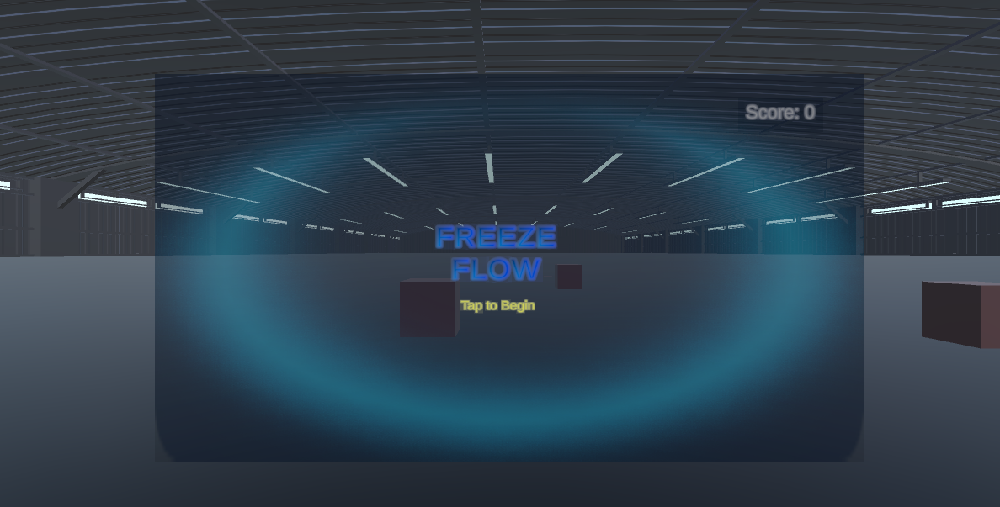
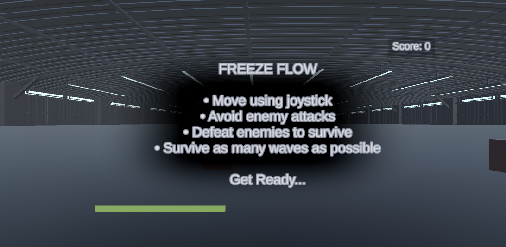
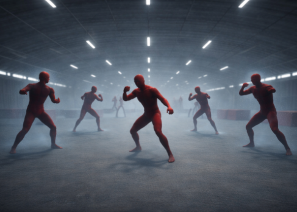
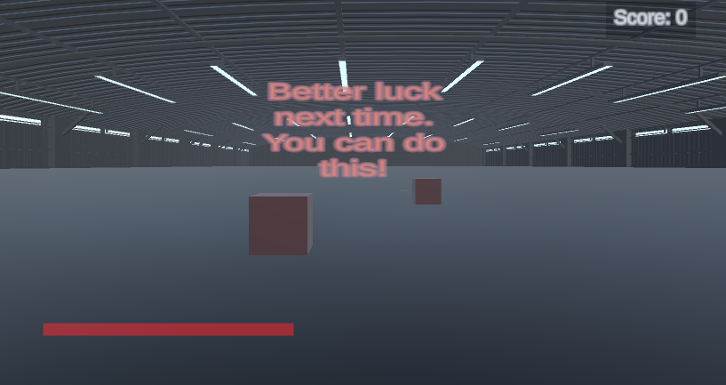
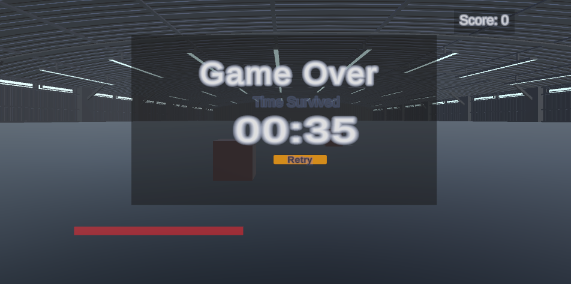

# 🎮 Freeze Flow VR

**Freeze Flow VR** is an immersive survival-based **Virtual Reality game** developed using **Unity and C#**.
The player must survive waves of enemies while managing health and using a **unique time-freeze mechanic** that activates during critical moments.

---

## 🚀 Key Features

* ⏳ **Health-Triggered Time Freeze**
  Time slows or freezes when the player’s health drops below a critical level.

* 🤖 **AI Enemies with NavMesh**
  Intelligent enemies that chase and surround the player using Unity NavMesh.

* 🌊 **Wave-Based Enemy System**
  Enemies spawn in increasing difficulty waves to challenge the player.

* ❤️ **Risk-Reward Healing System**
  Killing enemies restores health under certain conditions.

* 🥽 **Immersive VR Gameplay**
  Designed for a fully immersive virtual reality experience.

---

## 🛠️ Technologies Used

* **Unity Game Engine**
* **C# Programming**
* **Unity NavMesh AI**
* **Virtual Reality (VR) Integration**
* **Coroutine-based Wave Management**

---

## 🎯 Gameplay Concept

In **Freeze Flow VR**, players are placed in a hostile environment where enemies continuously attack.
The player must survive by dodging, moving strategically, and using the **freeze-time mechanic** when the situation becomes critical.

This mechanic allows players to react quickly when surrounded or when health becomes dangerously low.

---

## 📂 Project Structure

```
Assets/
Packages/
ProjectSettings/
.gitignore
```

These folders contain all essential Unity project files required to run the game.

---

## 🧠 Learning Objectives

This project demonstrates:

* Game AI implementation
* VR interaction design
* Real-time game mechanics
* Performance optimization in Unity
* Game system balancing

---

## 📸 Screenshots







---

## 👨‍💻 Author

**Shaik Irfan**
B.E Computer Science and Engineering
Saveetha School of Engineering

---

## ⭐ Future Improvements

* More enemy types
* Advanced weapon mechanics
* Multiplayer VR mode
* Improved environment design

---
